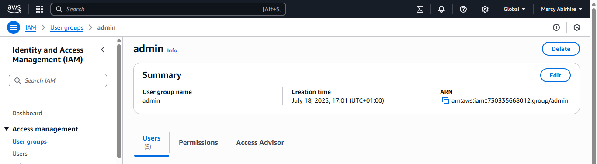
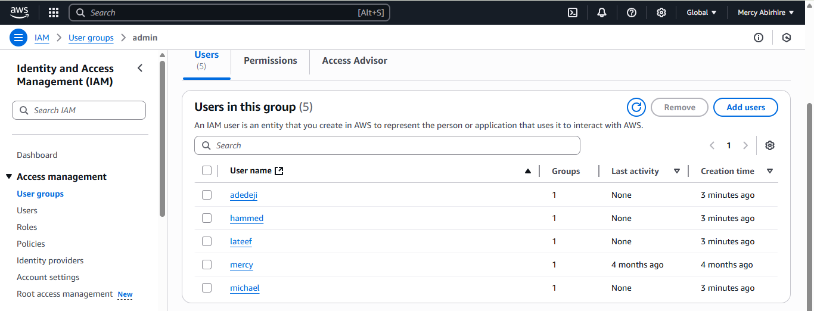

# cloudops-solutions

## Project Deliverables
This section provides the comprehensive documentation of the thought process behind developing the aws-iam-manager.sh script, followed by the complete script itself.

## Deliverable 1:
Comprehensive Documentation of Thought Process
Project Title: Automating AWS IAM Management for CloudOps Solutions

**Purpose:**
The primary purpose of this project is to extend shell scripting capabilities to automate the management of AWS Identity and Access Management (IAM) resources. Specifically, it focuses on creating IAM users, user groups, and assigning administrative permissions for new hires within CloudOps Solutions' DevOps team, ensuring a streamlined and consistent onboarding process.

## Objectives Recap:
The script aims to fulfill the following objectives:

1. Define an IAM User Names Array to store the names of five IAM users for easy iteration during user creation.

2. Create the IAM Users by iterating through the array using AWS CLI commands.

3. Define and call a function to create an IAM group named "admin" using AWS CLI commands.

4. Attach an AWS-managed administrative policy (e.g., "AdministratorAccess") to the "admin" group to grant administrative privileges.

5. Iterate through the array of IAM user names and assign each user to the "admin" group using AWS CLI commands.

## Thought Process & Implementation Details:

1. Choosing the Right Tools:

* Bash Scripting: Selected for its native integration with Linux environments, ability to execute shell commands directly, and its suitability for automation tasks.

* AWS CLI: This is the indispensable tool for interacting with AWS services from the command line. All IAM operations (creating users, groups, attaching policies) will be performed using aws iam commands.

2. Script Structure and Robustness:

* Shebang (#!/bin/bash): Essential first line to ensure the script is executed by the Bash interpreter.

* Strict Mode (set -euo pipefail): Implemented at the beginning of the script for robust error handling.

    * set -e: Exits immediately if a command exits with a non-zero status (failure). This prevents the script from continuing with potentially erroneous states.

    * set -u: Treats unset variables as an error and exits. This helps catch typos and ensures all variables are intentionally defined.

    * set -o pipefail: Ensures that if any command in a pipeline fails, the entire pipeline fails, preventing masked errors.

* Comments: Extensive comments are used throughout the script to explain the purpose of sections, functions, variables, and complex logic, adhering to best practices for readability and maintainability.

3. Data Structure for User Names (Objective 1):

* An indexed array was chosen to store the five IAM user names ("adedeji", "michael", "lateef", "mercy", "hammed"). This allows for easy iteration over the list using a for loop, making the script scalable if more users need to be added in the future.

* iam_users=("adedeji" "michael" "lateef" "mercy" "hammed")

4. Modular Design with Functions (Objective 3):

* To enhance readability, reusability, and organization, the script's logic is broken down into several dedicated functions. This aligns with the project's emphasis on "Working with Functions."

* create_iam_group(): This function encapsulates the logic for creating the "admin" IAM group. It includes a check to see if the group already exists (aws iam get-group) to prevent errors if the script is run multiple times.

* attach_policy_to_group(): This function handles attaching the "AdministratorAccess" policy to a specified group. It also checks if the policy is already attached to avoid redundant operations and errors.

* create_iam_user(): This function creates an individual IAM user. It includes a check for user existence to make the script idempotent (running it multiple times produces the same result without errors).

* add_user_to_group(): This function adds a specified user to a specified group, with a check to ensure the user is not already a member of the group.

5. AWS CLI Commands for IAM Management (Objectives 2, 3, 4, 5):

* aws iam create-group --group-name "$group_name": Used within create_iam_group to create the "admin" group.

* aws iam attach-group-policy --group-name "$group_name" --policy-arn "$policy_arn": Used within attach_policy_to_group to grant AdministratorAccess (ARN: arn:aws:iam::aws:policy/AdministratorAccess) to the "admin" group.

* aws iam create-user --user-name "$user_name": Used within create_iam_user to create each user from the array.

* aws iam add-user-to-group --user-name "$user_name" --group-name "$group_name": Used within add_user_to_group to assign each created user to the "admin" group.

6. Error Handling and Idempotency:

. Each function includes checks (aws iam get-user, aws iam get-group, aws iam list-attached-group-policies) to determine if the resource (user, group, policy attachment) already exists. This makes the script idempotent, meaning it can be run multiple times without causing errors or unintended side effects if the resources are already in place.

* Error messages are printed to >&2 (standard error) for better logging and separation from normal output.

* The return 1 or exit 1 statements are used to indicate failure, which set -e will then act upon to stop the script if a critical step fails.

7. Main Execution Flow:

* The script's main logic calls the defined functions in a sequential manner, ensuring that groups are created and policies attached before users are added to them.

* A for loop iterates through the iam_users array, calling create_iam_user and add_user_to_group for each user.

Pre-requisites Addressed:

* AWS CLI Configuration: The script assumes that aws cli is already installed and configured with appropriate credentials and permissions to manage IAM resources. Without this, the aws iam commands will fail.

* Linux Foundations: The script leverages fundamental shell scripting concepts like variables, arrays, functions, conditional statements, and loops, which are built upon prior Linux foundations.

## Deliverable 2:

Extended Script (aws-iam-manager.sh)
Here is the complete Bash script that fulfills all the project objectives:
AWS IAM Management Automation Script

[View Script on GitHub](https://github.com/mabirhire1/cloudops-solutions/blob/main/aws-iam-manager.sh)

**How to Use the Script:**

Save: Save the code above into a file named aws-iam-manager.sh (or any .sh name you prefer) on your Linux system.

Make Executable: Open your terminal, navigate to where you saved the file, and make it executable:

Bash

chmod +x aws-iam-manager.sh
Run: Execute the script:

Bash

./aws-iam-manager.sh
The script will print messages indicating its progress, including whether groups/users already exist or if they are being created/modified. After successful execution, you can verify the IAM users and the "admin" group in your AWS Management Console.

Verify Group Creation

Verify Users Creation
